# Fluxogramas do Simulador de SO

Diagramas de apoio à apresentação. Renderizam automaticamente no GitHub e no
VS Code. As imagens correspondentes (PNG) estão em `docs/img/`.

> Para a apresentação, os principais são: **1. Fluxo geral**, **2. Arquitetura**,
> **4. Escalonamento** e **5. Memória virtual**. Os diagramas 3 (CSV) e 6
> (Relatório) servem de detalhamento, se houver tempo.

## 1. Fluxograma geral do sistema

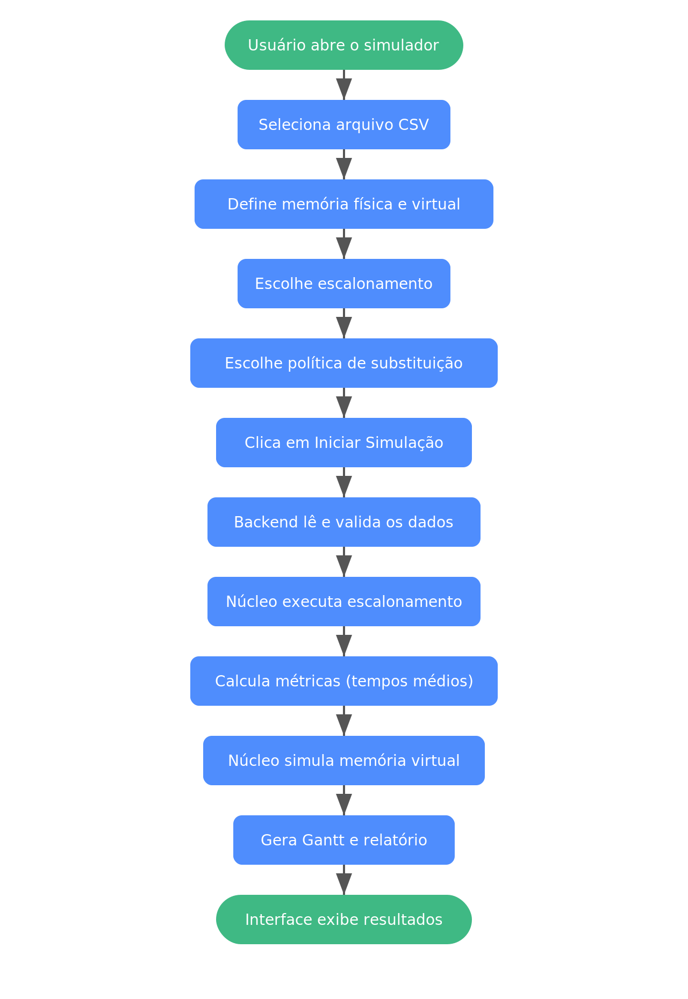

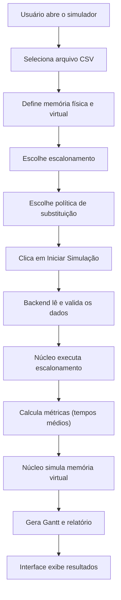

## 2. Arquitetura do código

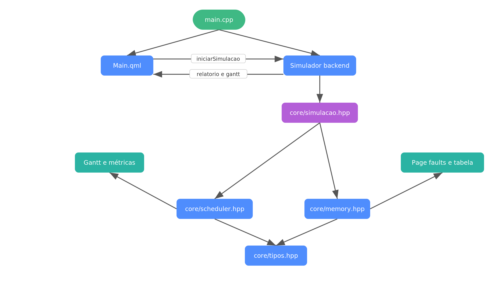

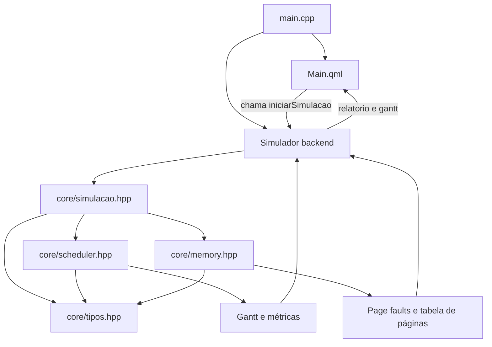

## 3. Leitura do CSV

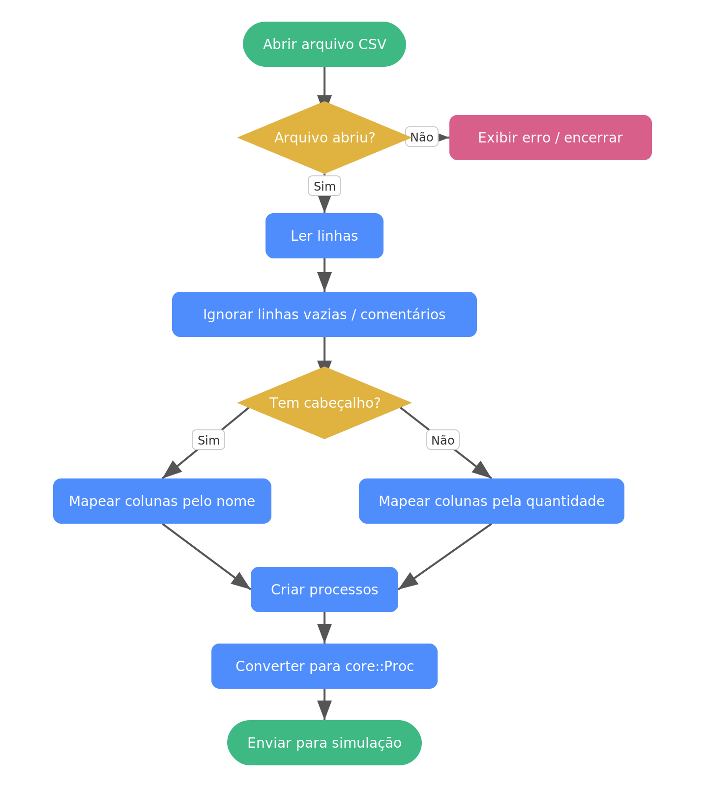

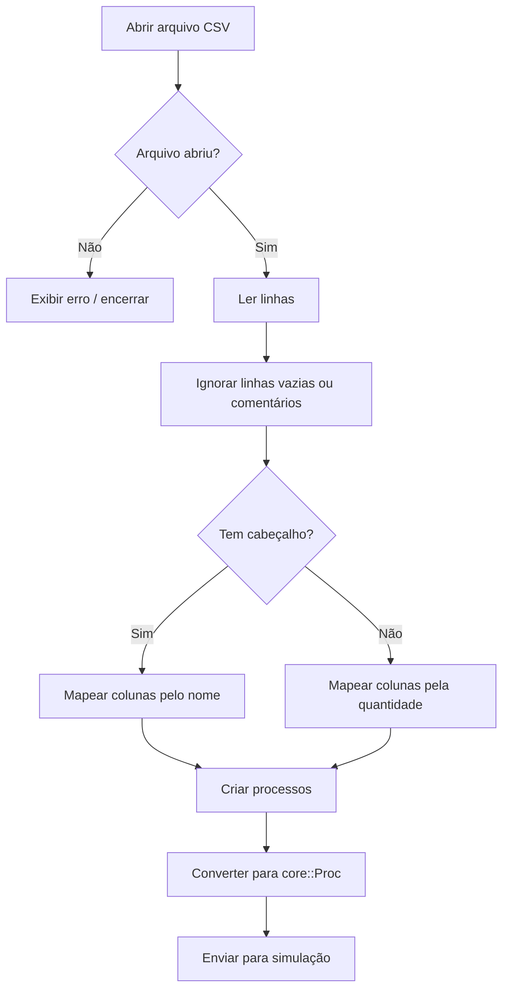

## 4. Escalonamento (RR, SJF-P e Prioridade-P)

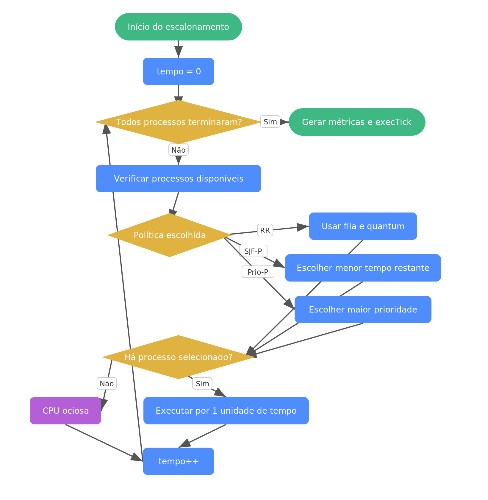

A seleção é reavaliada a cada unidade de tempo — é isso que torna SJF e
Prioridade preemptivos.

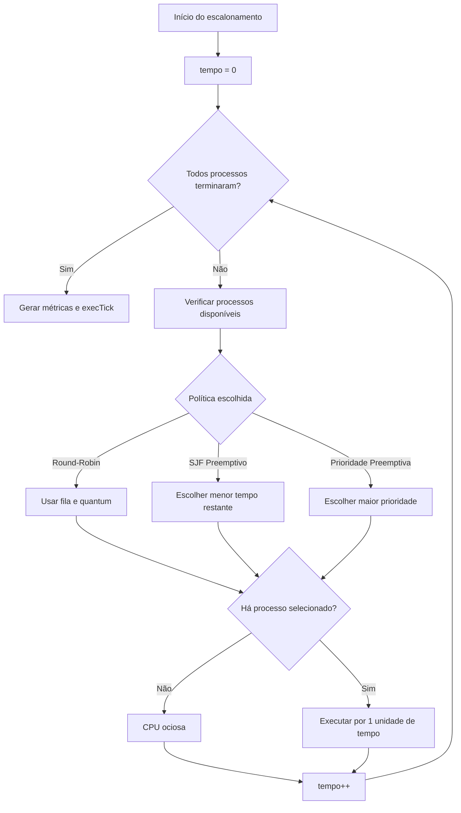

## 5. Memória virtual (page fault e substituição)

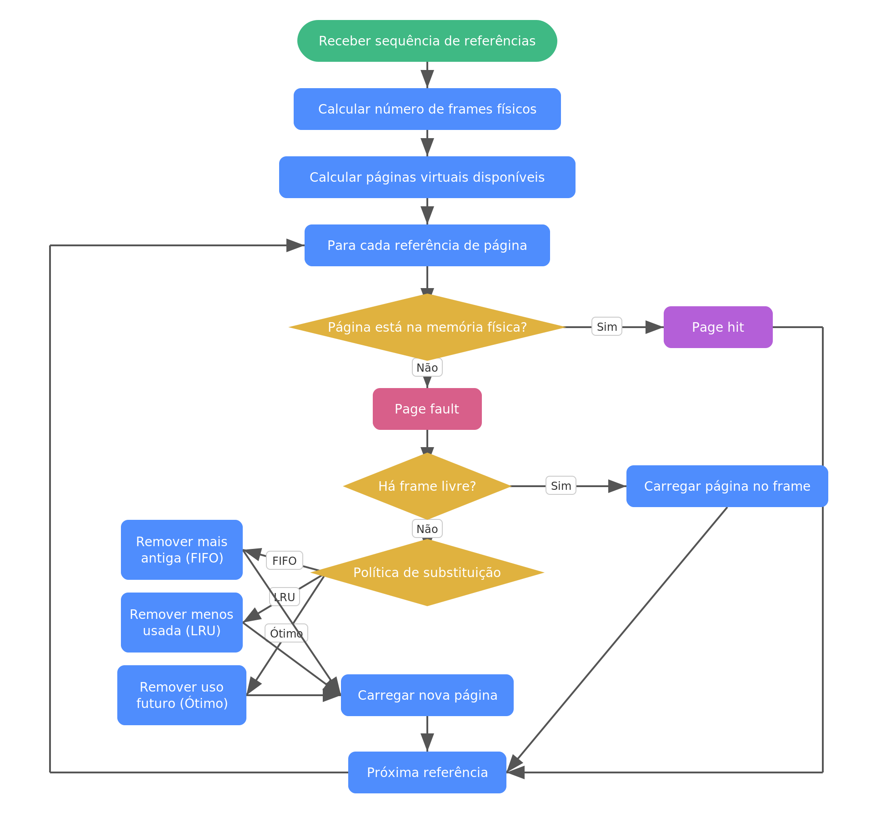

O escalonamento roda antes e gera a string de referência completa; por isso o
algoritmo Ótimo consegue "olhar o futuro".

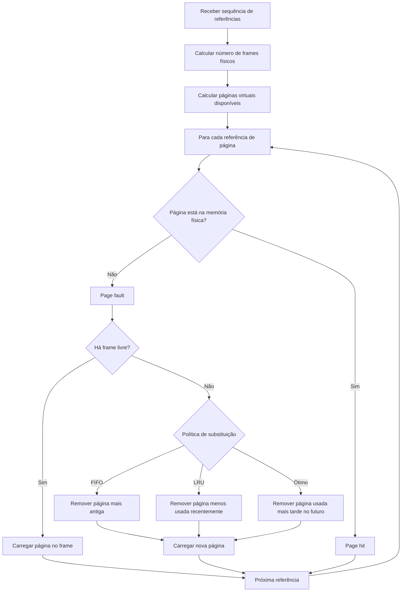

## 6. Geração do relatório

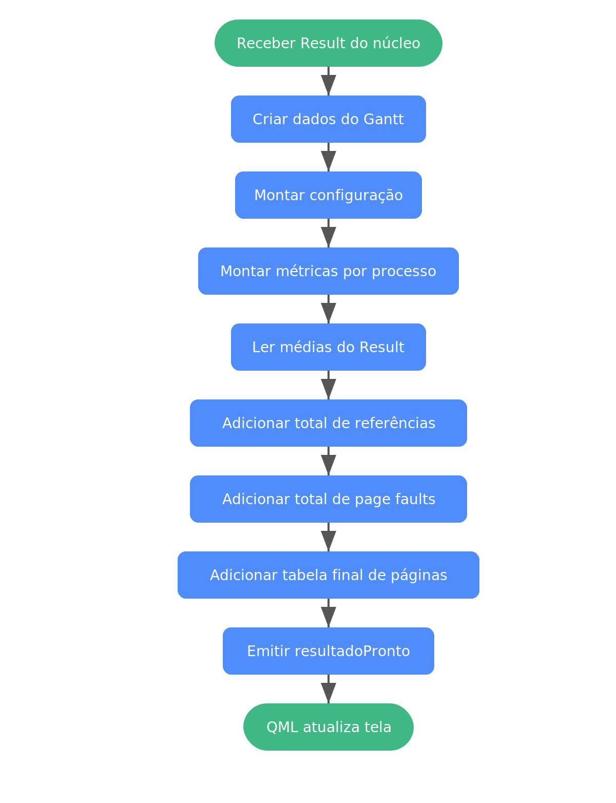

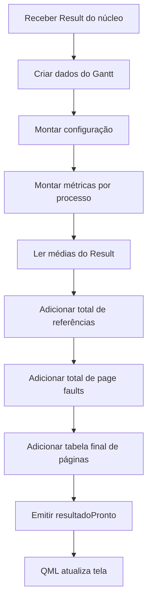
